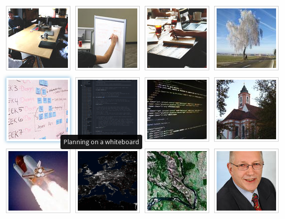

# makethumbsf6

Make thumbnails, responsive images and HTML / Zurb Foundation 6 markup all in one go!

---

## Need all of these quick?


With _makethumbsf6_ you can!

---

## Features

- All devices, all image sizes
- Your own breakpoints
- JPEG, PNG, GIF (also animated), TIFF, MPO (3D stereo)
- Image format conversions (i.e. TIFF → JPEG)

---

## And more …

- Normal or squared (cropped) thumbnails
- Sample HTML page
- Lightbox (PhotoSwipe)
- Automatic captions from EXIF/IPTC/XMP image data
- Foundation 6 partial ready to include

---

## ZURB Foundation 6



_makethumbsf6_ generates a complete partial.

Ready to include.

---

## Thumbnails

### Code

`<figure>` with a link to the hi-res

```html
<figure itemprop="associatedMedia" itemscope itemtype="http://schema.org/ImageObject" title="Houston, we have ignition &hellip; and lift-off!">
  <a class="thumbnail" role="button" aria-label="Thumbnail" href="xl/090-lift-off.xl.jpg" itemprop="contentUrl" data-size="1920x1235">
    
  </a>
  <figcaption itemprop="caption description" title="Houston, we have ignition &hellip; and lift-off!"><h4>Houston, we have ignition &hellip; and lift-off!</h4><p></p></figcaption>
</figure>
```

---

## Thumbnails

### Features

- includes caption (can be disabled via CSS)
- automatically generated from image’s EXIF/IPTC/XMP data
- SEO optimized
- _schema.org_ tags
- _ARIA_ labels
- W3C and WAVE validating markup

---

## Responsive Images

### Code

`<figure>` with a `srcset` — best for responsive

```html
<figure itemprop="associatedMedia" itemscope itemtype="http://schema.org/ImageObject" title="Houston, we have ignition &hellip; and lift-off!">
  
  <figcaption itemprop="caption description" title="Houston, we have ignition &hellip; and lift-off!"><h4>Houston, we have ignition &hellip; and lift-off!</h4><p></p></figcaption>
</figure>
```
Handles Retina, too.

---

## Responsive Images

### Features

- includes caption (can be disabled via CSS)
- automatically generated from image’s EXIF/IPTC/XMP data
- SEO optimized
- _schema.org_ tags
- _ARIA_ labels
- W3C and WAVE validating code

---

## It’s Auto-Magic.

Just run `makethumbsf6` inside any images folder.

---

## Get it NOW! For free.

<a href="https://github.com/Moonbase59/makethumbsf6" target="_blank">On Github</a>

Or visit the <a href="http://kaufen-ist-toll.de/demos/makethumbsf6/sample-gallery/" target="_blank">Sample HTML page</a>
