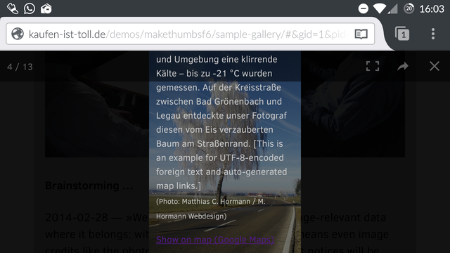
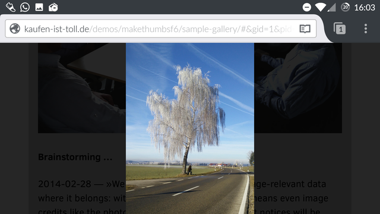
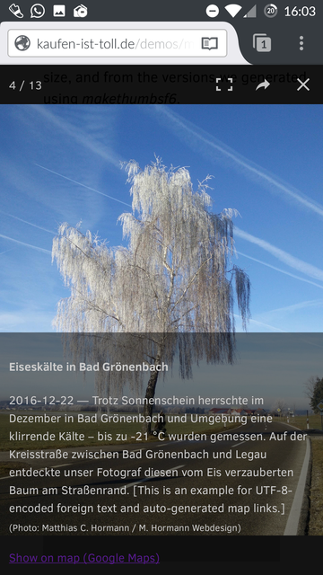
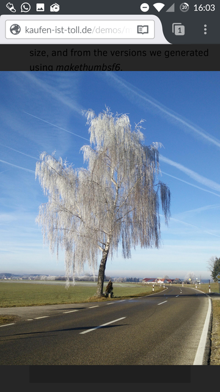
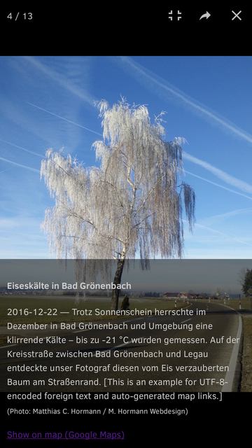
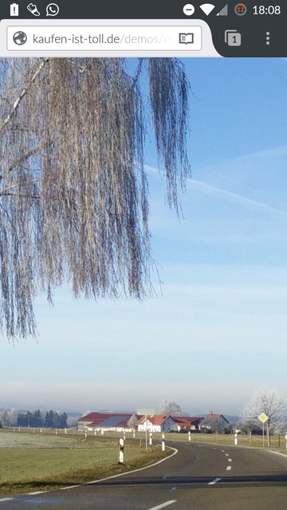
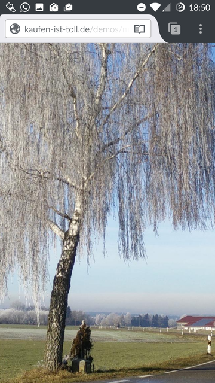
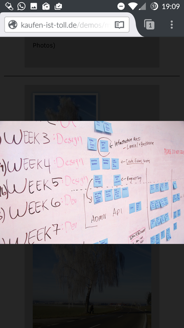

# The lightbox on small devices

_2017-04-29 – Matthias C. Hormann_

## Usage hints you might not have known.

 Made possible by the beautiful »[PhotoSwipe](http://photoswipe.com/)«.

On small devices (like my Andoid smartphone), images might be overlaid if you have lots of text within your image caption. This is especially true if you use the »wrong« orientation, i.e. watching a portrait image in your phone’s landscape mode.

Here are some actual screenshots from my Android smartphone, checking out the [demo page](http://kaufen-ist-toll.de/demos/makethumbsf6/sample-gallery/):

  
_<small>Portrait image in landscape mode with lots of text</small>_

**Tap on the text once** to hide it (tapping again will unhide it):

  
_<small>Portrait image in landscape mode with no text</small>_

Or just **rotate your phone by 90°** into portrait mode. Image and text should automatically adapt:

  
_<small>Portrait image in portrait mode with lots of text</small>_

Again, to hide the text, **tap on the text**:

  
_<small>Portrait image in portrait mode with no text</small>_

**Tap the »Fullscreen« icon** to get a little more screen estate:

  
_<small>Portrait image in portrait mode, fullscreen</small>_

**Stretch and pinch** to zoom in or out:

  
_<small>Portrait image, stretched to zoom in (text hidden)</small>_

**Tap and hold** then **move** in the image area to move around inside a zoomed image:

  
_<small>Portrait image, moving around in zoomed state (text hidden)</small>_

**Double-tap** on the image to restore its original size:

  
_<small>Portrait image, original size restored (text hidden)</small>_

**Swipe left/right** to move to the next/previous gallery image:

  
_<small>Next image (Landscape image, portrait mode, text still hidden)</small>_

**Swipe up or down** to close the lightbox.
This is the same as tapping the »X« button at the upper right.

**Enjoy!**
